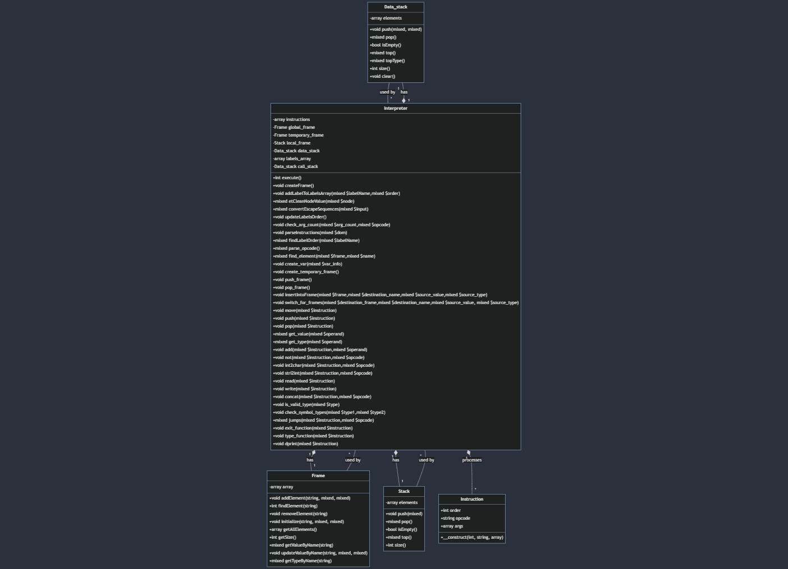

# Implementačná dokumentácia k 2. úlohe do IPP 2023/24

**Meno a priezvisko**: Matúš Janek

**Login:** 237464

## 1. Úvod

Tento projekt bol zameraný na implementáciu scriptu interpret.php ktorý načíta vstupný kód podľa formátu a špecifikácie IPPcode24, ktorý bol prenkovertovaný na xml inštrukcie.
Odoovzdaný súbor obsahuje 4 triedy ktoré sú implemntované v týchto súboroch: `Data_Stack.php` , `Frame.php`, `Instruction.php` a `Stack.php`

## 2. Návrh tried

### Data_Stack: 

Táto trieda bola implentovaná kvôli zásobníkovým inštrukciám a obsauje atribút `array_elements`, obsahuje metódy ktoré slúžia pre základnú funkcionalitu zásobníku. Prvky poľa `array_elements` obsahujú typ a hodnotu daného elementu. Konštruktor incializuje pole `array_elements`.
V súbore `interpreter.php` bola vytvorená inštancia tejto treidy s ktorou sa následnovne pracovalo.

### Frame:

Trieda zapuzdruje základné operácie pri práci s globálnym a dočasným rámcom, vďaka jej metódam. Obsahuje atribút `array`, ktorý bude slúžiť pre ukldananie jednotlivých premmených a konštantých hodnôt. Konštruktor inicializuje pole `array`. Prvky poľa `array` obsahujú typ,názov a hodnotu. V súbore `interpret.php` sa vytvorí inštancia tejto triedy s cez ktorú pracujeme s jej inštančnými metódami a inštančným atribútom.

### Instruction:

Trieda ktorá slúži na ukldannie atribútov inštrukcií. Obsahuje atribúty `order`, `opcode` a `args`. Pri vytváraní inštancie tejto triedy sa inicializujú všetky jej atribúty. V súbore `interpreter.php` pri narazení na inštrukciu pri parsovaní xml kódu sa vytvorí inštancia triedy `Instruction`, ktorá sa uloží do poľa `instructions`.

### Stack

Trieda Stack obsahuje atribút pole `elememnts`, ktorý bude obsahovať jednotlive inštančné triedy `Frame`. Trieda reprezntuje chovanie lokálneho rámca ktorého funkcionalita je totožná so zásobníkom. Funkcie zásobníku boli implemtované ako metódy triedy `Stack`. Konštruktor inicializuje pole `elements`. V súbore `intepreter.php` je vytvorená inštancia triedy Stack, s ktorou sa následnovne pracuje. Prvky poľa `elements` obsahujú objekty.

## 3. Implementácia a logika programu

Hlavná logika programu sa nachádza v súbore `interpreter.php` v triede `Interpreter`

### Spustenie programu

Program je spustený pomocou prikazu `php interpter.php` a vsutpnymi argumentami. `--source=` špecifikuje vstupný súbor a `--input= špecifikuje` vstupné hodnoty v prípade čítania. Program podporuje aj parameter `--help` ktorý vypíše nápovedu.

### Deklarácia/Definícia premenných a hlavná funkcia

Na začiatku sa deklarujú premmené pre jednotlivé rámce a definujú sa premmené ako napríklad `labels_array` ktorá bude slúžiť pre ukladanie pozícií skokov. Funkcia `execute()` následne reprezentuje hlavnú funkciu programu ktorá riadi poradie vykonania jednotlivých funkcií. V tejto funkcii sa taktiež načíta vstupný súbor pomocou `$dom = $this->source->getDOMDocument()` ktorá vstupný súbor uloži do premmenej dom.

### Parsovanie inštrukcií

Vo funkcii `parseInstructions($dom)`, sa zo vstupného súboru extrahuje xml kód a skontroluje sa jeho syntax, v prípade že poradie inšrtukcií nieje v vzostupne rastúcom poradí tak sa upraví ich poradie, následne sa jednotlivé atributy inštrukcie uložia do inštancie triedy `Instruction`, ktorá sa následovne uloží do pola `instructions`. V prípade že daná inštrukcia je `LABEL` tak sa daná lokácia uloži do pola `labels_array`.

### Vytvorenie rámcov

Vo funkcii `createFrame()` sa do deklaroaných premmených uložia inštancia triedy `Frame` pre globálny rámec a inštancia triedy `Data_Stack`, pre prácu s dátovým zásobníkom. Globálny rámec a zásbník sú definované ako jediné pred exekúciou jednotlivých inštrukcií. 

### Vykonávanie inštrukcií

Funkcia `parse_opcode()` reprezentuje statový automat ktorý začne vykonávať inštrukcie na základe jeho operačného kódu. Inštrukcie sa načítávajú z poľa `instructions`. Podľa operačného kódu vstúpime do jednotlivých funkcií.

## 4. Rozšírenie

### Stack

Toto rozšírenie obsahovalo niektoré aritmetické operácie ktoré zobralo dva elementy z dátoveho zásobníku `data_stack` a následne vykonalo danú operáciu. Pre toto rozšírenie bolo do jednotlivých funkcií pre vykonávanie operácii operačného kódu pridaná možnosť podpory operačných kódov ako `ADDS`, `SUBS`, a niekoľko ďalších. Podľa operačného kódu sa potom do lokálnych premmených uložili buď argumenty inštrukcie alebo prvoky zo zásobníku.

## 5. UML

